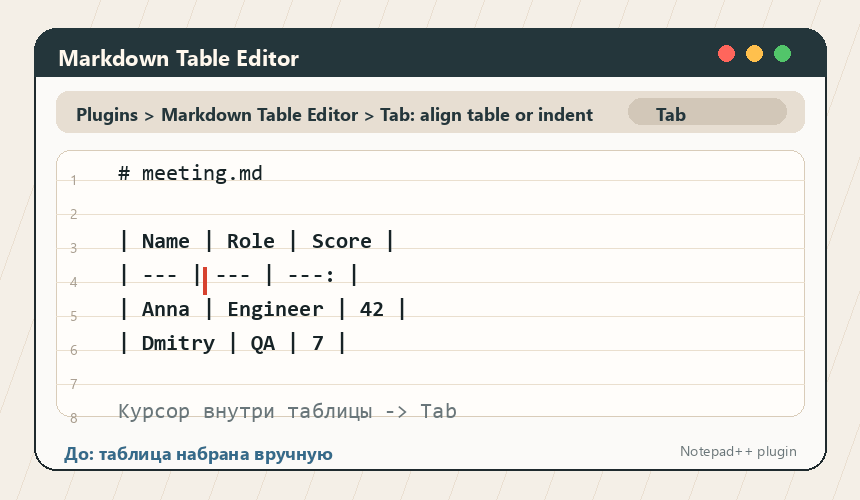

# Markdown Table Editor для Notepad++

[](https://github.com/krotname/NppMarkdownTableEditor/actions/workflows/CI_build.yml)
[](https://github.com/krotname/NppMarkdownTableEditor/actions/workflows/codeql.yml?query=branch%3Amaster)
[](https://codecov.io/gh/krotname/NppMarkdownTableEditor)
[](https://securityscorecards.dev/viewer/?uri=github.com/krotname/NppMarkdownTableEditor)
[](https://www.bestpractices.dev/projects/13152)
[](https://github.com/krotname/NppMarkdownTableEditor/releases/latest)
[](LICENSE)
[](https://isocpp.org/)
[](https://github.com/notepad-plus-plus/nppPluginList/pull/1127)
[](https://markdowntableeditor.krot.name/)

Markdown Table Editor превращает Notepad++ в удобный редактор Markdown-таблиц.
Берёте чужую косую таблицу или сгенерированную ИИ, запускаете команду выравнивания, а плагин выровняет колонки, сохранит Markdown-разметку
и поможет быстро переставлять строки, колонки и данные.

## Другие версии

- Для JetBrains IDEs: [IdeaMarkdownTableEditor](https://github.com/krotname/IdeaMarkdownTableEditor)

## Демо



GIF собран из реальных скриншотов Notepad++ под Windows: открыт обычный `.md` файл, команда `Выровнять таблицу (без изменения ширины)` вызвана из меню плагина.

## Зачем он нужен

- Не нужно уходить из Notepad++ в отдельный Markdown-редактор только ради таблиц. 
- Большие pipe-таблицы остаются читаемыми в plain text.
- Выравнивание, сортировка и операции со строками/колонками экономят ручную правку.
- CSV/TSV можно быстро превратить в аккуратную Markdown-таблицу.
- UTF-8 и CJK-символы учитываются при расчете ширины колонок.
- Меню, команды, диалоги и сообщения плагина следуют локализации Notepad++ для популярных языков.

## Возможности

- Выравнивание таблицы вокруг курсора.
- Переход к следующей или предыдущей ячейке.
- Вставка, удаление и перемещение строк.
- Вставка, удаление и перемещение колонок.
- Сужение или расширение текущей колонки на одну экранную позицию.
- Сортировка строк по текущей колонке по возрастанию или убыванию.
- Перенос длинных ячеек в строки-продолжения под текущую ширину окна Notepad++, чтобы широкие реестры было легче редактировать в plain text; если места совсем мало, длинные слова режутся внутри ячейки.
- Конвертация выделенного CSV/TSV-текста или текущего CSV/TSV-блока в Markdown-таблицу.
- Определение CSV/TSV-блока игнорирует запятые внутри кавычек и не захватывает соседний обычный текст.
- Вставка новой таблицы с выбранным числом колонок и строк.
- Сохранение Markdown-маркеров выравнивания: `---`, `:---`, `---:`, `:---:`.
- Корректная обработка escaped pipes: `\|`.
- Оптимизирована работа с большими таблицами; отдельные performance benchmarks входят в CI.

## Установка

1. Скачайте ZIP-архив из последнего релиза: https://github.com/krotname/NppMarkdownTableEditor/releases/latest
2. Распакуйте архив.
3. Скопируйте папку `MarkdownTableEditor` в каталог плагинов Notepad++.
4. Перезапустите Notepad++.
5. Откройте меню `Plugins > Markdown Table Editor`.

Обычный путь для 64-битного Notepad++:

```text
C:\Program Files\Notepad++\plugins\MarkdownTableEditor\MarkdownTableEditor.dll
```

Если Windows не дает писать в `Program Files`, установите плагин в пользовательский каталог:

```text
%LOCALAPPDATA%\Notepad++\plugins\MarkdownTableEditor\MarkdownTableEditor.dll
```

## Проверка Релиза

Каждый release публикует ZIP-архивы для x86/x64/arm64, Plugin Admin ZIP,
`SHA256SUMS.txt`, CycloneDX SBOM и GitHub attestations.

```bash
sha256sum -c SHA256SUMS.txt
gh attestation verify MarkdownTableEditor-*-x64.zip --repo krotname/NppMarkdownTableEditor
```

## Публикация

- PR в официальный Notepad++ Plugin List: https://github.com/notepad-plus-plus/nppPluginList/pull/1127

## Совместимость

| Архитектура Notepad++ | Минимальная версия |
| --------------------- | ------------------ |
| x86                   | 7.5.9              |
| x64                   | 8.3.1              |
| ARM64                 | 8.3.1              |

На x64 Notepad++ 7.5.9-8.2.1 плагин загружается и пункт меню появляется, но команды редактирования таблиц не меняют документ. Notepad++ 7.5.9 не выпускался в ARM64-сборке.

## Команды

| Команда                                        | Что делает                                                               |
| ---------------------------------------------- | ------------------------------------------------------------------------ |
| `Выровнять таблицу (без изменения ширины)`     | Разово выравнивает текущую Markdown-таблицу, не подгоняя ее под окно     |
| `Light Автовыравнивание после правки (без изменения ширины)` | Автоматически выравнивает таблицу после правки; включено при первой установке и отключает ручное выравнивание |
| `Подогнать ширину таблицы под окно`            | Разово подгоняет текущую таблицу под видимую ширину: сужает длинные ячейки или склеивает строки-продолжения при расширении окна |
| `Power Автоподгонка ширины таблицы под окно`   | Автоматически подгоняет таблицу под ширину редактора; включено при первой установке, отключает ручную подгонку и держит Light автовыравнивание включенным |
| `Next cell` / `Previous cell`                  | Перемещает курсор между ячейками                                         |
| `Insert row below` / `Delete row`              | Добавляет или удаляет строку                                             |
| `Insert column right` / `Delete column`        | Добавляет или удаляет колонку                                            |
| `Narrow column` / `Widen column`               | Сужает или расширяет текущую колонку на одну экранную позицию            |
| `Move row up` / `Move row down`                | Перемещает текущую строку                                                |
| `Move column left` / `Move column right`       | Перемещает текущую колонку                                               |
| `Sort rows ascending` / `Sort rows descending` | Сортирует строки по текущей колонке                                      |
| `Convert CSV/TSV to table`                     | Превращает выделенный CSV/TSV или текущий блок в Markdown-таблицу        |
| `Insert table...`                              | Вставляет новую таблицу заданного размера                                |

Например, выделите `Name,Score` и следующую строку `Anna,10` или поставьте курсор внутрь такого блока.
Выполните `Plugins > Markdown Table Editor > Convert CSV/TSV to table`.
Получится Markdown-таблица с колонками `Name` и `Score`.

Горячие клавиши по умолчанию:

Команды используют `Ctrl+Alt+Shift` с верхним цифровым рядом, соседними клавишами и понятными буквами для автоматических режимов, чтобы не занимать стандартные сочетания JetBrains IDE и Notepad++.

| Команда                                        | Сочетание          |
| ---------------------------------------------- | ------------------ |
| `Выровнять таблицу (без изменения ширины)`     | `Ctrl+Alt+Shift+1` |
| `Light Автовыравнивание после правки (без изменения ширины)` | `Ctrl+Alt+Shift+A` |
| `Подогнать ширину таблицы под окно`            | `Ctrl+Alt+Shift+W` |
| `Power Автоподгонка ширины таблицы под окно`   | `Ctrl+Alt+Shift+F` |
| `Next cell`                                    | `Ctrl+Alt+Shift+2` |
| `Previous cell`                                | `Ctrl+Alt+Shift+3` |
| `Insert row below`                             | `Ctrl+Alt+Shift+4` |
| `Delete row`                                   | `Ctrl+Alt+Shift+5` |
| `Insert column right`                          | `Ctrl+Alt+Shift+6` |
| `Delete column`                                | `Ctrl+Alt+Shift+7` |
| `Narrow column`                                | `Ctrl+Alt+Shift+,` |
| `Widen column`                                 | `Ctrl+Alt+Shift+.` |
| `Move row up`                                  | `Ctrl+Alt+Shift+8` |
| `Move row down`                                | `Ctrl+Alt+Shift+9` |
| `Move column left`                             | `Ctrl+Alt+Shift+[` |
| `Move column right`                            | `Ctrl+Alt+Shift+]` |
| `Sort rows ascending`                          | `Ctrl+Alt+Shift+=` |
| `Sort rows descending`                         | `Ctrl+Alt+Shift+-` |
| `Convert CSV/TSV to table`                     | `Ctrl+Alt+Shift+0` |
| `Insert table...`                              | `Ctrl+Alt+Shift+\` |

### Подгонка ширины и штатный перенос Notepad++

| `Power Автоподгонка ширины таблицы под окно` | `Перенос строк` Notepad++ | Результат |
| --- | --- | --- |
| Выкл | Выкл | Таблица не перестраивается, длинные строки уходят вправо. |
| Выкл | Вкл | Работает только визуальный перенос Notepad++; файл не меняется, широкая Markdown-таблица может выглядеть рвано. |
| Вкл | Выкл | Плагин физически переносит текст внутри ячеек, сохраняя правую границу таблицы в видимой ширине, пока это возможно. |
| Вкл | Вкл | Плагин держит физические строки таблицы в видимой ширине; штатный перенос остаётся запасным визуальным режимом для совсем узкого окна или текста после ручного сужения. |

## Сборка и тесты

Нужны Visual Studio 2022 Build Tools. Команды ниже запускайте из Developer Command Prompt или после добавления MSBuild в `PATH`.

```cmd
msbuild Package.proj /t:Package /p:Configuration=Release /p:Platform=x64
```

Версия плагина задается только в `Version.props`. `Package.proj`, DLL version resource и release ZIP-имена читают это значение; `/p:Version` не является источником версии и при несовпадении с `Version.props` считается ошибкой.

Готовые ZIP-архивы появятся в папке `build`.

Ручная сборка через MSBuild:

```cmd
msbuild vs.proj\MarkdownTableEditor.vcxproj /p:Configuration=Release /p:Platform=x64
```

DLL будет создана здесь:

```text
bin64\MarkdownTableEditor.dll
```

Запуск smoke-тестов ядра:

```cmd
msbuild Package.proj /t:RunCoreSmokeTests
```

Отчет покрытия C++ core:

```cmd
msbuild Package.proj /t:Coverage /p:Configuration=Debug /p:Platform=x64
```

Cobertura XML появится в `build/reports/coverage/coverage.cobertura.xml`.

Performance benchmarks ядра:

```cmd
msbuild Package.proj /t:CorePerformance /p:Configuration=Release /p:Platform=x64
```
